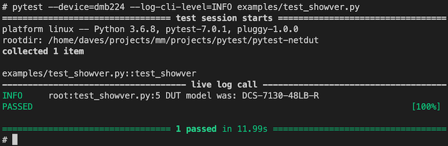
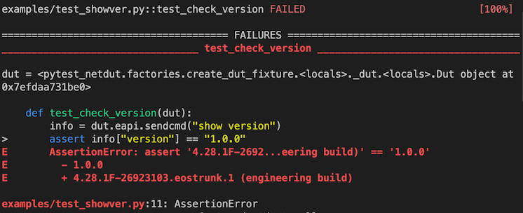

Netdut: automated software testing for switches using pytest
============================================================

 

 


Netdut is a [pytest](https://docs.pytest.org/) plugin which provides infrastructure (e.g. pytest fixtures) which make it easy to write automated tests for network switches.


Features
--------

* Brings the power, maturity and ecosystem of pytest to testing on network switches.
* The `dut` fixture (Device Under Test) providing serial, ssh or [EAPI](https://github.com/arista-eosplus/pyeapi) connectivity for running CLI commands on a network switch. 
* Command-line configuration of a hostname and console name. 
* Markers for skipping tests based on the device's type or software configuration.
* Compatibility with both Arista's EOS operating system, and the Metamako MOS operating system.
* A pythonic interfaces for writing EOS CLI commands.


Requirements
------------

* Requires python3 >= 3.6, pexpect, pyeapi
* Network devices under test (DUTs) must be accessible via SSH.


Installation
------------

You can install `pytest-netdut` via [pip](https://pypi.org/project/pip/) from [PyPI](https://pypi.org/project):

    $ pip install pytest-netdut

The `pytest-netdut` plugin is not auto-loaded upon installation. To enable pytest-netdut for your
tests, add the following to a `conftest.py` file:

```
pytest_plugins = ["pytest_netdut"]
```

or explicitly add it when you run pytest:

```
pytest -p pytest_netdut
```


Usage
-----

### Basics

Several example tests using pytest-netdut are contained in [examples/](examples/). Note that there is a `conftest.py` in that directory which enables pytest-netdut and increases the verbosity of the CLI output.

The DUT must be accessible via SSH to use the SSH or EAPI fixtures (the latter enables and disables the EAPI using SSH). This can usually be achieved using this EOS config:

```text
    enable
        configure
            username admin privilege 15 nopassword
            aaa authorization exec default local
```

`test_showver.py` demonstrates some basic examples using the dut fixture. The tests can be
be run using the command below.

```bash
pytest --device=<YOUR_DEVICE_IP_OR_DNS> examples/test_showver.py
```

`test_showver` runs `show version` via EAPI:

```python
def test_showver(dut):
    info = dut.eapi.sendcmd("show version")
    logging.critical(f"DUT model was: {info['modelName']}")
```

Running this using a device with a hostname of `dmb224` gives some simple output:




### Assertions

Because this is pytest, we get great feedback when tests fail. Tests fail upon assertions. Here we use the test below as an example.

```python
def test_check_version(dut):
    info = dut.eapi.sendcmd("show version")
    assert info["version"] == "1.0.0"
```

Netdut will start EAPI and use it to run the `show version` command, returning the results as a python dictionary. The assertion then fails, assuming the DUT is not running version 1.0.0 of EOS (in this case it is running an old internal build):




### Running multiple commands

It's rare that a test will execute a single command on the DUT. Netdut allows for multi-command tests. This can be seen in [examples/test_daemon.py](examples/test_daemon.py) where the daemon
is configured:

```python
dut.eapi.sendcmds("""
        enable
            configure
                daemon sleeper
                    exec /usr/bin/sleep 10
                    no shutdown
    """)
```

In this case the result that is returned is list of the results of each command. It's often useful
to just return the last one:

```python
def daemon_has_started():
    daemon_info = dut.eapi.sendcmds(["enable", f"show daemon {sleeper_daemon}"])[-1]
    return daemon_info["daemons"][sleeper_daemon]["starttime"] != 0.0
```

### Waiting for results

It's often useful to provide some configuration to the switch, and then wait for the
switch to act (since it's running asynchronously). pytest-netdut provides the
`wait_for` fixture for this purpose. Again, in
[examples/test_daemon.py](examples/test_daemon.py) we use `wait_for` to wait for
the daemon to start and stop.

```python
# daemon_has_started is defined as a local function
# wait_for calls it repeatedly until it's true
wait_for(daemon_has_started, timeout=10.0)
```

### Skipping based on DUT type

Perhaps some tests won't run on every type of device -- `pytest-netdut` provides some skipping mechanisms for this purpose. To skip a test on a particular on a DUT type use the provided
decorator:

```python
@pytest.mark.skip_device_type("DCS-7130.*", reason="Demo")
def test_that_skips_7130(dut):
    logging.info("Must not be 7130!")
```

Similar decorators exist for OS type (i.e. EOS-only or MOS-only tests), and can be stacked:
```python
@pytest.mark.eos
@pytest.mark.skip_device_type("DCS-7130.*")
def test_that_only_runs_on_eos_on_7130(dut):
    logging.info("Must be EOS on 7130!")
```

### Building test harnesses

Pytest's fixture mechanism is very powerful in this scenario, allowing us to set up and tear
down test configurations with low overhead.

```python
@pytest.fixture
def my_test_harness(dut):
    dut.eapi.sendcmds(["enable",
                          "configure",
                              "banner motd My test is running, hands off!"])
    yield
    dut.eapi.sendcmds(["enable", "configure", "no banner"])

def test_mytest(my_test_harness):
    logging.info("Running my test here")
```

### Translations

In order to reduce test code verbosity and complexity a translator class provides a way to standardize tests to a particular OS.
Both CLI commands and results are standardized to EOS by default.

A particular test can be written with EOS CLI and be run on MOS as well.
Consider the `l1 source` command which differs between EOS and MOS:

```python
@pytest.fixture
def l1_connect(dut):
    if dut.ssh.cli_flavor == "eos":
        dut.eapi.sendcmds(["enable",
                              "configure",
                                  "interface Ethernet10",
                                      "l1 source interface Ethernet12"])
    elif dut.ssh.cli_flavor == "mos":
        dut.eapi.sendcmds(["enable",
                              "configure",
                                  "interface Ethernet10",
                                      "source Ethernet12"])
```

which can be reduced to:

```python
@pytest.fixture
def l1_connect(dut):
    dut.eapi.sendcmds(["enable",
                        "configure",
                            "interface Ethernet10",
                                "l1 source interface Ethernet12"])
```

The translator will try to find a match for each command in the predefined list of regex configuration patterns.

The translator will also process return values; MOS EAPI result keys are camelCased and the translator will convert all keys
to snake_case.

The translator has a predefined set of translations which can be extended by subclassing the Translator class and overriding `config_patterns`.
Return values are processed by the `translate_key` function which must be defined in the subclass.

Set the new translator class via `eapi.set_translator(<class instance>)`. 

Contributing
------------
This project is under active use and development. We would appreciate help to improve it,
via pull request. Tests can be run with `make ci` or `tox`.

Docstrings are according to [Google's docstring conventions](https://google.github.io/styleguide/pyguide.html) ([examples](https://sphinxcontrib-napoleon.readthedocs.io/en/latest/example_google.html)).


License
-------

Distributed under the terms of the [BSD-3](http://opensource.org/licenses/BSD-3-Clause) license, `pytest-netdut` is free and open source software


Issues
------

If you encounter any problems, please [file an issue](https://github.com/dcasnowdon-anet/pytest-netdut/issues) along with a detailed description.